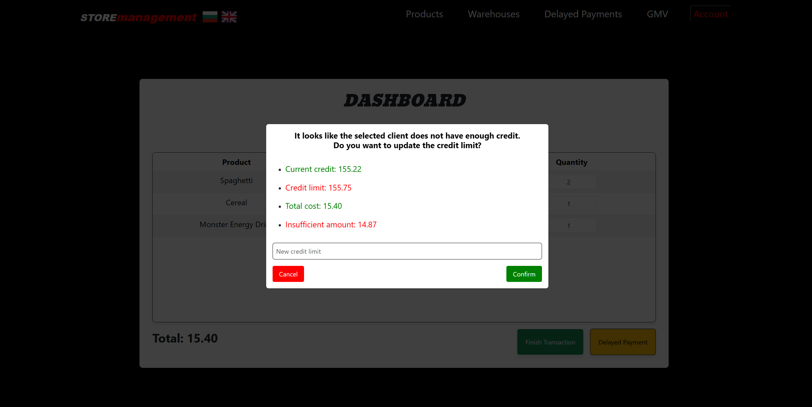
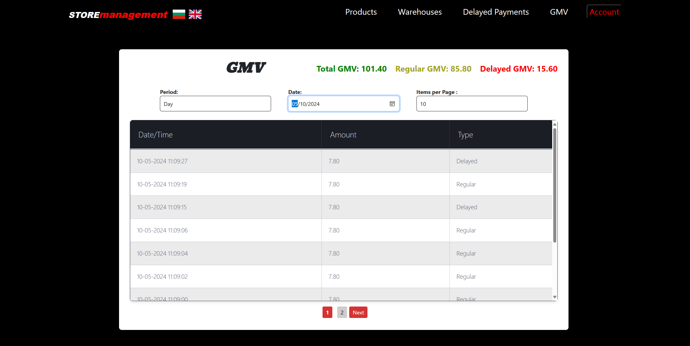
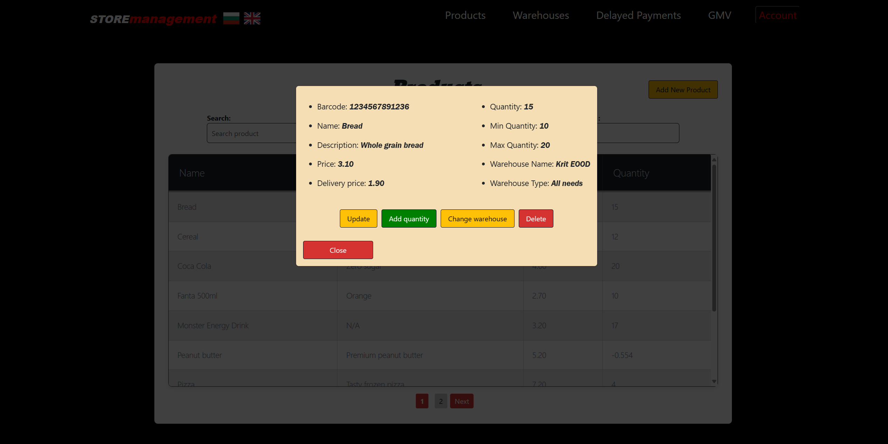
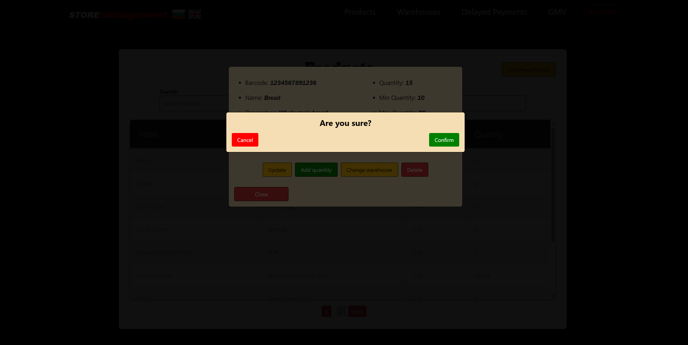
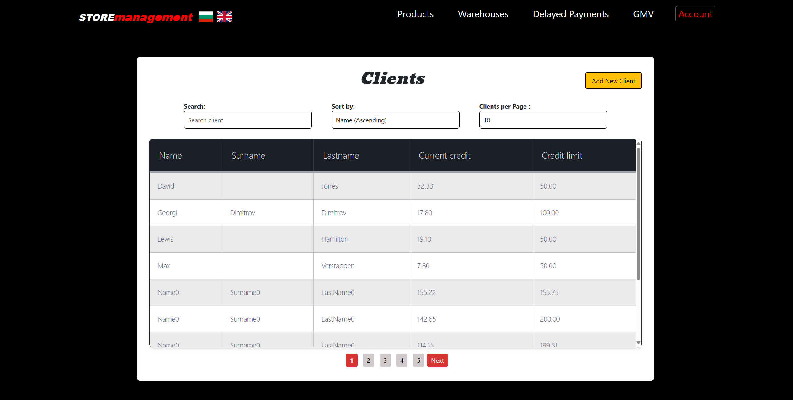
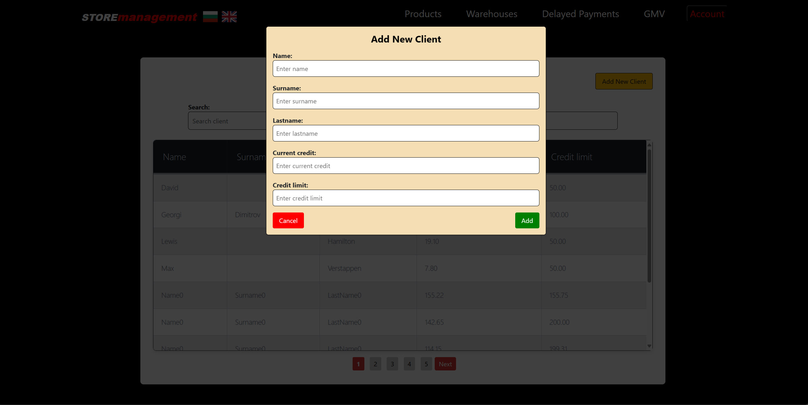
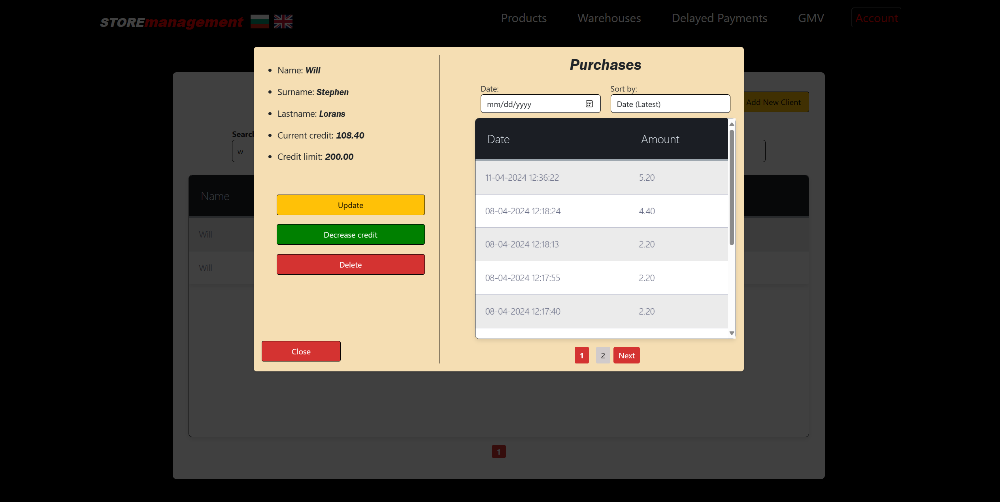
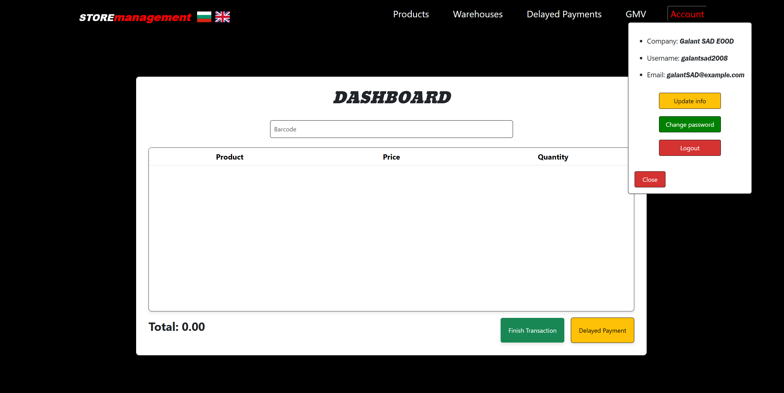

# Store Management System

## Overview

The Store Management System is a robust application designed to streamline operations for small to medium-sized supermarkets. At its core, the system provides comprehensive management of products and warehouses, while also facilitating the monitoring of Gross Merchandise Value (GMV). A standout feature of the system is the ability to handle delayed payments, allowing supermarkets to offer flexible payment solutions to their clients.

### Key Features

- **Product Management:** Manage product inventory with real-time updates and stock monitoring.
- **Warehouse Oversight:** Manages the stocks of products and suggests order quantities based on current stock levels to ensure optimal inventory management.
- **GMV Tracking:** Automatically calculate and track Gross Merchandise Value to assess sales performance and support data-driven decision-making.
- **Delayed Payments:** Provide customers with deferred payment options to enhance service and financial management.

### Technical Architecture

The project is built using a microservice architecture with .NET following the REST principles and ensuring scalability and robust performance. It includes five main services:

- **Product Service:** Manages all operations related to products.
- **Warehouse Service:** Oversees stock management, including tracking stock levels and providing recommendations for reorder quantities to maintain optimal inventory levels.
- **Delayed Payment Service:** Facilitates the processing and management of delayed payments.
- **GMV Service:** Responsible for the calculation and reporting of GMV.
- **Identity Service:** Manages secure access and user interactions across the platform.

These services utilize RabbitMQ and gRPC for efficient and reliable inter-service communication. The entire backend is deployed on Kubernetes, offering enhanced scalability and resilience. The Ingress NGINX controller serves as the gateway, facilitating smooth interaction with external systems and clients.

### Frontend

The interface is crafted with React, providing a responsive and intuitive experience that simplifies supermarket management.

## Technologies Used

This project utilizes a range of technologies to deliver a comprehensive and robust system. Below is a breakdown of the main technologies and libraries used:

### Backend
- **.NET 8**: Used for building the microservices with high performance and scalability in mind.
- **Entity Framework**: ORM for data access, simplifying interactions with the MSSQL Server database.
- **MSSQL Server**: The database system used for storing all application data reliably.
- **JWT**: Utilized for securing the services by handling authentication and authorization across the system.
- **RabbitMQ**: Messaging broker for handling communications between the different services efficiently.
- **gRPC**: A high-performance, open-source framework for handling remote procedure calls, used between microservices.
- **Kubernetes**: Container orchestration platform used to deploy, scale, and manage the microservices.

### Frontend
- **React**: A JavaScript library for building user interfaces, enabling dynamic and responsive client-side interactions.
- **HTML & CSS**: Core technologies for structuring and styling the web application.
- **React Router**: Utilized for handling navigation and routing within the React application, enhancing the single-page app (SPA) experience.
- **React-toastify**: A library used for adding notifications to the React applications.
- **React-loading**: Used to manage loading states in the UI, improving user experience during asynchronous operations.

### Networking
- **Ingress NGINX**: An Ingress controller for Kubernetes using NGINX as a reverse proxy and load balancer.

## Screenshots

Below are some screenshots from the Store Management System, showcasing its key functionalities:

### Home page (not logged in)

### Login
*Allows the user to log in with his email or username.*

### Register

### Home page (logged in)
*The Main Dashboard serves as the operational hub for cashiers. With a seamless barcode reader integration (currently under development), products are quickly added to the transaction list upon scanning. Each item can be removed easily with the appearance of a remove button upon hover. The 'Finish Transaction' button completes the sale (stores the transaction) and updates inventory quantities accordingly. For customer convenience, the 'Delayed Payment' button triggers a modal to select or add a client, recording the transaction for future payment—ideal for repeat customers who prefer to settle their accounts at a later date.*

### Delayed payment modal

### Insufficient credit modal
*The 'Insufficient Credit' modal is a critical feature for managing customer transactions on credit. When a client's purchases approach or exceed their allotted credit limit, this prompt appears, displaying their current credit, credit limit, total purchase cost, and the insufficient amount that prevents the transaction from completing. It offers the functionality to update the client's credit limit on the spot, enabling a seamless continuation of the checkout process.*

### GMV (day)
*The GMV (Gross Merchandise Value) Service Interface provides a dynamic analysis of sales transactions across different timeframes. It displays detailed transaction data, including date, amount, and type (Regular or Delayed), based on the selected period: day, month, or year. Users can select a specific date to view daily transactions, or choose a month or year from the dropdown menus to see aggregated data for those periods. The interface includes a total GMV summary, showcasing total, regular, and delayed transactions, facilitating comprehensive financial oversight.*

### GMV (month)

### GMV (year)

### Products
*The Products page is a central feature of the Store Management System, offering a detailed and paged overview of all products. Users can effortlessly search for products, sort the list by various attributes like name, price, or quantity, and decide the number of products to display per page for customized viewing. Clicking on any product item brings up a detailed product information window, making it simple to view and manage product specifics.*

### Add new product
*Streamlining product entry, the 'Add New Product' form is a vital component for inventory expansion. Users can input new product details, including barcode, name, description, and price, as well as defining the quantity and setting minimum and maximum stock levels. The form also allows for selecting the supplying warehouse from a searchable dropdown, ensuring that each product is properly linked to its source. Dynamic validation is built into the form, ensuring data integrity and prompting users for any necessary corrections before submission.*

### Product details
*The Product Details window presents a comprehensive view of individual product metrics and management options. Detailed information such as barcode, name, description, price, delivery price, stock quantities, and linked warehouse is neatly displayed. Administrative actions are readily accessible, with options to update product details, add stock quantities, change the assigned warehouse, or delete the product from the inventory.*

### Update product
*The Update Product window allows the user to update the individual product metrics. Dynamic validation is built into the form, ensuring data integrity and prompting users for any necessary corrections before submission.*

### Add quantity
*The Add Quantity window allows the user to easily and quickly add a supplied quantity to the specific product.*

### Change warehouse
*The 'Change Warehouse' window facilitates the management of product sourcing within the system. It enables users to assign a different warehouse for a specific product with ease. The interface presents a searchable list of available warehouses, along with their types, allowing for a swift selection process. This feature ensures that the product inventory can be dynamically linked to different warehouses based on availability or strategic requirements.*

### Delete modal
*To safeguard against unintentional deletions, the 'Delete Confirmation' modal requires user confirmation before removing a product. This prompt ensures that actions are intentional, preventing accidental loss of data.*

### Warehouses
*The Warehouses page is the nexus for supplier management, listing the partner companies that supply the store's products. It enables users to view and sort supplier details, such as the company name and the types of products they supply, as well as the total number of distinct items sourced from each. The interface allows for intuitive navigation and management, with features like paged viewing, searching, and sorting. Additionally, the 'Add New Warehouse' function facilitates the effortless onboarding of new suppliers, ensuring that the store's product range is consistently diverse and well-stocked.*

### Warehouse details
*The Warehouse Details page is an informative section that displays the profile of a selected supplier and the products they provide. It offers features for searching and sorting through the product list, along with pagination to handle extensive inventories. A specialized function is the 'Show Low Stock Items' toggle, which filters the view to products needing restock, accompanied by a recommended order quantity for each. This page also plans to include an 'Export to Excel' option, making it easy to handle ordering and inventory management offline. The implementation of the export feature is currently underway.*

### Clients
*The Clients page is an essential part of the Store Management System, allowing for efficient tracking and management of customer accounts. It features a searchable and sortable table, displaying client names, current credit, and credit limits. With pagination capabilities, the system handles a vast number of client records seamlessly. The 'Add New Client' button is prominently placed for easy access to adding new customer profiles, ensuring that the business can quickly onboard new clients and maintain a high level of service.*

### Add new client
*The 'Add Client' form is a streamlined interface for inputting new customer data into the Store Management System. Designed for ease of use, it captures essential details such as name, surname, and credit information. Dynamic validation ensures that all entered data meets the system's requirements before submission, promoting accuracy and efficiency.*

### Client details
*The Client Details window provides a comprehensive view of an individual client's information and transaction history. It features the client's name, current credit, and credit limit, with options to update their details, adjust their credit, or remove them from the system. On the right, the client's purchase history is listed by date and amount, offering a clear record of transactions. Clicking on a specific purchase will open a detailed breakdown of the items bought, including their prices and quantities, which is instrumental for detailed sales tracking.*

### Purchase details

### Update client
*The 'Update Client' form is a versatile interface designed for managing client data within the Store Management System. It allows for adjustments to be made to a client's name, credit status, and credit limit. Highlighting its user-friendly features, the form includes dynamic validation to guide correct data entry and prevent errors.*

### Account details
*The Account Details pop-up serves as a personal dashboard for user account management within the Store Management System. It concisely displays the account holder's company, username, and contact information. Users are afforded the convenience of directly updating their information, changing their password, or logging out of the system with a simple click. These options ensure that account security and personal details are easily maintained, promoting a secure and personalized user experience.*

### Change password
*Security is paramount in the Store Management System, and the 'Change Password' interface upholds this principle by providing users with a straightforward process to update their credentials. It requires entry of the current password for verification and the new password twice for confirmation, ensuring changes are deliberate and authenticated.*

